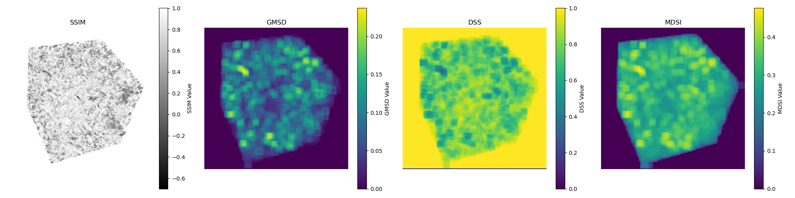
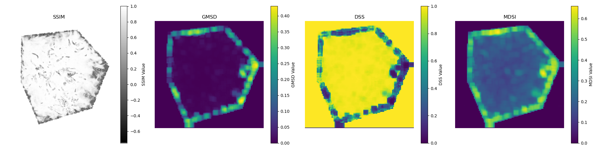

# Project Libra


### Overview
This project provides tools to compute various image quality assessment (IQA) metrics. 


## Features
- **Compute Image Quality Assesment Metrics**: Assessment quality with multiple full and no reference metrics
- **Multiple Color Spaces**: Support for different color spaces (e.g., RGB, HSV) to assess image quality in various domains.
- **Heatmaps Generation**: Generate metric maps visualizing the spatial distribution of metric values across the image
- **Image Difference**: Generate thresholded difference images to highlight significant differences between two images
- **Configurable via JSON**: Flexible configuration through JSON files for specifying image paths, metrics, color spaces, and output options.

It supports:
- 18 [full-reference](#full-reference-metrics)
- 5 [no-reference](#no-reference-metrics)
- [image diffs](#image-quality-maps) in 8 different [color spaces](#compatible-color-spaces) with flexible thresholding


The full reference and no reference metrics are from these python packages:
- [piq](https://pypi.org/project/piq/)
- [piya](https://pypi.org/project/pyiqa/)
- [imageHash](https://pypi.org/project/ImageHash/)

### Examples:
Some example comparison databases are available here: https://lanl.github.io/libra/


## Installation
1. Clone Repository
```
git clone https://github.com/lanl/libra
```
2. Install Dependencies
```sh
pip install opencv-python-headless numpy matplotlib scikit-image torch piq pyiqa ImageHash
```

Note: some dependecies are not available through conda. We recommend using virtual environments for now.

## Usage

A command line interface is provided, that is accessive as follows:
```
python src/app.py -h
```

There are three modes to use the tool:
- using a JSON file
- using the command line interface
- as a library
  
### JSON

The JSON configuration file should contain the following keys:

- **reference_image_path (str)**: Path to the reference image.
- **distorted_image_path (str)**: Path to the distorted image.
- **output_directory (str)**: Path to the output directory where the CSV file and metric maps will be saved.
- **output_filename (str, optional)**: Name of the output CSV file (default: "metrics.csv").
- **generate_metrics (bool, optional)**: Flag to generate metrics (default: False).
- **generate_maps (bool, optional)**: Flag to generate metric maps (default: False).
- **generate_image_difference (bool, optional)**: Flag to generate thresholded difference images (default: False).
- **difference_threshold (int, optional)**: Threshold value for generating thresholded difference images (default: 10).
- **metrics (list of str, optional)**: List of metrics to compute.
- **color_spaces (list of str, optional)**: List of color spaces to use for computing metrics (default: ["RGB"]).
- **map_window_size (int, optional)**: Window size for computing metric maps (default: 161).
- **map_step_size (int, optional)**: Step size for computing metric maps (default: 50).

---

Here is an example of a JSON configuration, also available in the samples folder:

```json
{
    "reference_image_path": "tests/data/test/orig.png",
    "distorted_image_path": "tests/data/test/compressed.png",
    "output_directory": "test_output",
    "output_filename": "metrics.csv",
    "generate_maps": true,
    "generate_metrics": true,
    "generate_image_difference": true,
    "difference_threshold": 10,
    "metrics": ["PSNR", "SSIM", "VSI", "GMSD", "MSE", "DSS"],
    "color_spaces": ["RGB", "HSV", "LAB"],
    "map_window_size": 161,
    "map_step_size": 50
}
```

It can be run from the home directory as follows:
```
python src/app.py -j samples/sample_input.json
```

### Command Line
The command line interface is useful for quick comparisons between two images. It can be used e.g. as
```
python src/main.py -r tests/data/test/orig.png -c tests/data/test/compressed.png -m SSIM -p
```

### Library
Refer to the example.ipynb notebook in the samples folder


## Example Usage

This example evaluates the visualization quality of isotropic turbulence dataset subjected to tensor compression with a maximum Peak Signal-to-Noise Ratio (PSNR) of 40. The assessment focuses on how effectively the tensor compression retains the visual fidelity of the turbulence data.

**References**\
**Dataset**: https://klacansky.com/open-scivis-datasets/\
**Compression Technique**: https://github.com/rballester/tthresh

<table>
  <tr>
    <td style="text-align: center;">
      <p style="font-weight: bold;">Reference Image</p>
      
    </td>
    <td style="text-align: center;">
      <p style="font-weight: bold;">Compressed Image (PSNR: 40)</p>
      
    </td>
  </tr>
</table>


### Image Quality Maps
### RGB Color Space


### HSV Color Space



# Supported Color Spaces

| **Color Space** | **Description** |
|-----------------|------------------------------------------------------------------------------------------------------|
| [RGB](https://en.wikipedia.org/wiki/RGB_color_model)  | Standard color space with three primary colors: Red, Green, and Blue. Commonly used in digital images and displays.    |
| [HSV](https://en.wikipedia.org/wiki/HSL_and_HSV)         | Stands for Hue, Saturation, and Value. Often used in image processing and computer vision because it separates color. |
| [HLS](https://en.wikipedia.org/wiki/HSL_and_HSV)         | Stands for Hue, Lightness, and Saturation. Similar to HSV but with a different way of representing colors.               | 
| [LAB](https://en.wikipedia.org/wiki/CIELAB_color_space)  | Consists of three components: Lightness (L*), a* (green to red), and b* (blue to yellow). Mimics human vision.        |
| [XYZ](https://en.wikipedia.org/wiki/CIE_1931_color_space)| A linear color space derived from the CIE 1931 color matching functions. Basis for many other color spaces.              |
| [LUV](https://en.wikipedia.org/wiki/CIELUV)              | Similar to LAB but with a different chromaticity component. Used in color difference calculations and image analysis.  |
| [YCbCr](https://en.wikipedia.org/wiki/YCbCr)             | Color space used in video compression. Separates the image into luminance (Y) and chrominance (Cb and Cr) components. |
| [YUV](https://en.wikipedia.org/wiki/YUV)                 | Used in analog television and some digital video formats. Separates image into luminance (Y) and chrominance (U and V). |


## Image Quality Assesment Metrics

### Full Reference Metrics


| Metric       |  Python Package | Description                                                                 | Value Ranges                                          | 
|--------------|-----------------|-----------------------------------------------------------------------------|------------------------------------------------------|
| [MSE](https://en.wikipedia.org/wiki/Mean_squared_error)          | libra | Measures the average squared difference between the reference and test images. | Range: [0, ∞). <br /> Lower MSE indicates higher similarity.               | 
| [SSIM](https://en.wikipedia.org/wiki/Structural_similarity)         | piq | Assesses the structural similarity between images considering luminance, contrast, and structure. | Range: [-1, 1]. <br /> Higher values indicate better similarity. |
| [PSNR](https://en.wikipedia.org/wiki/Peak_signal-to-noise_ratio)         | piq | Represents the ratio between the maximum possible power of a signal and the power of corrupting noise. | Range: [0, ∞) dB. <br /> Higher values indicate better image quality.    | 
| [FSIM](https://ieeexplore.ieee.org/document/5705575)         | piq | Evaluates image quality based on feature similarity considering phase congruency and gradient magnitude. | Range: [0, 1]. <br /> Higher values indicate better feature similarity. | 
| [MS-SSIM](https://en.wikipedia.org/wiki/Multi-scale_structural_similarity)      | piq | Extension of SSIM that evaluates image quality at multiple scales.          | Range: [0, 1]. <br /> Higher values indicate better structural similarity. | 
| [VSI](https://ieeexplore.ieee.org/document/6873260)          | piq | Measures image quality based on visual saliency.                            | Range: [0, 1]. <br /> Higher values indicate better visual similarity. | 
| [SR-SIM](https://ieeexplore.ieee.org/document/6467149)       | piq | Assesses image quality using spectral residual information.                 | Range: [0, 1]. <br /> Higher values indicate better visual similarity.                           | 
| [MS-GMSD](https://ieeexplore.ieee.org/document/7952357)      | piq |Evaluates image quality based on gradient magnitude similarity across multiple scales. | Range: [0, ∞). <br /> Lower values indicate higher similarity.     | 
| [LPIPS](https://arxiv.org/abs/1801.03924)        | piq |Uses deep learning models to assess perceptual similarity.                  | Range: [0, 1]. <br /> Lower values indicate higher similarity. | 
| [PieAPP](https://arxiv.org/abs/1806.02067)       | piq |Deep learning-based metric for perceptual image quality.                    | Range: [0, 1]. <br /> Lower values indicate higher quality.      | 
| [DISTS](https://arxiv.org/abs/2004.07728)        | piq |Combines deep learning features to evaluate image quality based on structure and texture similarity. | Range: [0, 1]. <br /> Lower values indicate higher similarity.                    | 
| [MDSI](https://arxiv.org/abs/1608.07433)         | piq |Measures image quality based on mean deviation similarity index.            | Range: [0, ∞). <br /> Lower values indicate better quality.                | 
| [DSS](https://ieeexplore.ieee.org/document/7351172)          | piq |Computes image quality using a detailed similarity structure.               | Range: [0, 1]. <br /> Higher values indicate better similarity.                  | 
| [IW-SSIM](https://ece.uwaterloo.ca/~z70wang/publications/IWSSIM.pdf)      | piq |Information-weighted SSIM that emphasizes important regions in images.      | Range: [0, 1]. <br /> Higher values indicate better structural similarity. | 
| [VIFp](https://ieeexplore.ieee.org/document/1576816)         | piq |Measures image quality based on visual information fidelity.                | Range: [0, 1]. <br /> Higher values indicate better preservation of information. |
| [GMSD](https://arxiv.org/abs/1308.3052)         | piq |Gradient Magnitude Similarity Deviation metric for assessing image quality. | Range: [0, ∞). <br /> Lower values indicate higher similarity.             |
| [HaarPSI](https://arxiv.org/abs/1607.06140)      | piq | Uses Haar wavelet-based perceptual similarity index to evaluate image quality. | Range: [0, 1]. <br /> Higher values indicate better perceptual similarity. | 
| [pHash](https://en.wikipedia.org/wiki/Perceptual_hashing) | ImageHash | Generates a compact hash value that represents the perceptual content of an image. | Range: [0, ∞). <br /> Higher values indicate worse perceptual similarity. | 


### No Reference Metrics

| Metric       |  Python Package | Description                                                                      | Value Ranges                                          | 
|--------------|-----------------|-----------------------------------------------------------------------------|------------------------------------------------------|
| [BRISQUE](https://live.ece.utexas.edu/research/Quality/BRISQUE_release.zip)    | pyiqa | Blind/Referenceless Image Spatial Quality Evaluator (BRISQUE) uses natural scene statistics to measure image quality.               | Range: [0, 100]. <br /> Lower values indicate better quality. | 
| [CLIP-IQA](https://arxiv.org/abs/2207.12396)   | piq | Image quality metric that utilizes the CLIP model to assess the visual quality of images based on their similarity to predefined text prompts.         | Range: [0, 1]. <br /> Higher values indicate better quality. | 
| [NIQE ](https://ieeexplore.ieee.org/document/6353522)      | pyiqa | Natural Image Quality Evaluator. It assesses image quality based on statistical features derived from natural scene statistics. | Range: [0, 100]. <br /> Lower values indicate better quality. | 
| [MUSIQ](https://arxiv.org/abs/2108.05997)      | pyiqa | Multi-Scale Image Quality. An advanced metric that evaluates image quality across multiple scales to better capture perceptual quality. | Range: [0, 1]. <br /> Higher values indicate better quality. |
| [NIMA](https://ieeexplore.ieee.org/document/8352823) | pyiqa | Neural Image Assessment. A deep learning-based model that predicts the aesthetic and technical quality of images. | Range: [0, 10]. <br /> Higher values indicate better quality. | 


